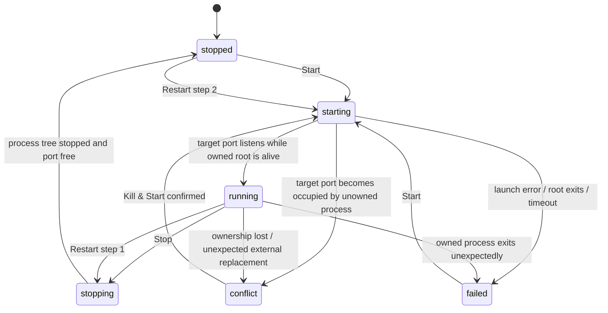

# Service Manager — Cross-platform Design and Implementation Plan

**Status:** READY FOR IMPLEMENTATION  
**Date:** 2026-09-30  
**Repository:** `mumu-140/port-manager`  
**Target platforms:** macOS + Windows  
**Out of scope for this increment:** Linux

---

## 1. Purpose

Port Manager currently discovers listening ports, shows the owning processes, and can terminate those processes. The next increment adds the inverse operation: users can save a local service profile and intentionally start, stop, restart, edit, and open that service from the application.

This is **not** an operating-system service manager. It does not manage `launchd`, Windows SCM services, systemd, login agents, or background daemons. It manages user-defined local commands that are expected to run in the foreground and listen on one configured TCP port.

The feature must behave consistently on macOS and Windows even though the implementation is platform-native.

### Required product behavior

A saved service profile contains:

- name
- port
- host
- working directory
- start command

The start command may use the `{port}` placeholder.

Primary actions:

- Start
- Stop
- Restart
- Edit
- Open

Secondary actions:

- Delete profile
- Start/stop a Cloudflare Quick Tunnel for a running managed service
- Resolve port conflicts by showing the occupying process and, only after explicit confirmation, terminating the occupant and retrying Start

Changing a running service is never an in-place socket mutation. The semantic rule is:

> **Stop → Edit profile → Start again**

---

## 2. Design goals

1. **Safe process ownership.** The app must never silently kill a process merely because it happens to listen on a configured port.
2. **Explicit conflict handling.** If a configured port is already occupied by an unowned process, show the process details and require explicit user action before killing it.
3. **Deterministic lifecycle.** Start, Stop, Restart, Edit, and Delete must have unambiguous state transitions.
4. **Cross-platform behavioral parity.** macOS and Windows use the same profile schema and state semantics.
5. **Native implementation.** Do not introduce a new cross-platform framework. Swift/SwiftUI remains the macOS implementation; C#/WPF remains the Windows implementation.
6. **Testability.** Process launching, port inspection, and persistence must be behind injectable seams so state-machine tests do not need real external processes.
7. **Reuse existing Port Manager capabilities.** Port scanning, process metadata, process killing, browser opening, and Cloudflare Quick Tunnel behavior should be reused rather than duplicated.
8. **No regression of the frozen macOS localization work.** Every new macOS user-visible string must use the existing `L("...")` registry.
9. **No upstream coupling.** Do not reintroduce any `productdevbook` runtime, release, sponsor, or update dependency.

---

## 3. Non-goals

The implementation must **not** expand into the following areas in this increment:

- Linux Service Manager UI or lifecycle implementation.
- `launchd`, Windows Service Control Manager, systemd, or OS-level service installation.
- Custom stop commands.
- Service dependency graphs.
- Multi-port service profiles.
- HTTP health-check endpoints.
- Automatic service startup at application launch.
- Automatic service restart after crashes.
- Importing arbitrary currently-running processes into the manager.
- Persisting process ownership across an application restart.
- Background daemonization independent of Port Manager.
- Shell selection in the UI.
- Remote services or SSH execution.
- Command synchronization between macOS and Windows.
- Renaming the existing PortKiller bundle/executable compatibility identifiers.

A future version may add some of these, but the present implementation must stay focused.

---

## 4. Terminology

### Managed service profile

Persisted user configuration describing one local service.

### Runtime state

Ephemeral, non-persisted state for a profile during the current Port Manager process lifetime.

### Owned process

A process launched by the Service Manager during the current app session and tracked by the manager.

### Port occupant

Any process currently listening on the profile's configured port.

### Conflict

The configured port is occupied, but the manager cannot prove that the listener belongs to the current session's managed runtime for that profile.

---

## 5. Product model

### 5.1 Persisted profile

The conceptual schema is identical on macOS and Windows:

```text
ManagedServiceConfig
- id: UUID / Guid
- name: String
- port: Int
- host: String
- workingDirectory: String
- startCommand: String
```

Recommended defaults:

- `host = "localhost"`
- `id` generated once and stable for the life of the profile

Do **not** persist PID, status, logs, tunnel URL, or process handles in this model.

### 5.2 Validation rules

A profile is valid only when:

- `name.trimmed` is non-empty.
- Name is unique case-insensitively among managed services.
- `port` is in `1...65535`.
- No second managed service profile uses the same configured port.
- `host.trimmed` is non-empty.
- `workingDirectory` exists and is a directory at save time.
- `startCommand.trimmed` is non-empty.
- The only supported template placeholder is `{port}`.
- Unknown brace-style placeholders such as `{PORT}`, `{host}`, or `{foo}` are rejected with a validation error.

The `{port}` placeholder is optional. If absent, the command is executed exactly as stored and the configured port is still used as the readiness target.

Helper text in the editor should state:

> Use `{port}` in the command if the command should automatically follow future port edits.

### 5.3 Host semantics

`host` is used for the **Open** URL and display only. It is not interpolated into the launch command in v1.

For browser opening:

- `0.0.0.0`, `*`, `::`, and `[::]` normalize to `localhost`.
- `localhost`, IPv4, IPv6, and ordinary host names are supported.
- Open uses `http://<normalized-host>:<port>`.
- HTTPS/scheme configuration is a future extension.

---

## 6. Runtime model and state machine

### 6.1 Runtime state

Each profile has an in-memory runtime object:

```text
ManagedServiceRuntime
- config
- status
- rootPID?
- listenerPIDs[]
- startedAt?
- lastExitCode?
- lastError?
- recentOutput[]    // bounded, memory-only
```

Suggested output limit: **200 lines per service**.

Logs are not persisted.

### 6.2 Status enum

Use these semantic states on both platforms:

```text
stopped
starting
running
stopping
conflict
failed
```

Optional UI-only properties may distinguish progress, but do not introduce alternate behavioral states without a clear need.

### 6.3 State transition rules



### 6.4 Reconciliation precedence

When reconciling a profile against current port scan data:

1. If an explicit Start/Stop operation is currently in progress, preserve `starting` or `stopping` until that operation resolves.
2. If the manager has an owned runtime for this profile and the configured port is listening as part of that runtime, state is `running`.
3. If the configured port is listening but there is no owned runtime, state is `conflict`.
4. If the configured port is free and there is no active owned process, state is `stopped`.
5. If a manager-launched process exits unexpectedly before or after readiness, state is `failed` and `lastError`/exit code is retained.

### 6.5 App restart safety rule

Runtime ownership is intentionally **not persisted** in v1.

Therefore:

- Profiles survive app restarts.
- Managed processes may continue running if the user quits Port Manager.
- On the next app launch, a listener already occupying the configured port is shown as `conflict`, even if it was previously launched by Port Manager.
- The app must never silently "reattach" and enable Stop based only on port number or command similarity.

This is a deliberate safety boundary. Cold-start reattachment can be designed later with stronger process identity proofs.

---

## 7. Command execution contract

### 7.1 General

Before launch:

1. Validate the current profile.
2. Render the start command by replacing every exact `{port}` occurrence with the decimal port number.
3. Do **not** interpolate the service name, working directory, or host into the shell command.
4. Set working directory using the process API, not shell `cd`.
5. Inherit the current application environment.
6. Add `PORT_MANAGER_SERVICE_ID=<profile-id>` to the child environment for diagnostics/future compatibility.
7. Redirect stdout and stderr.
8. Read the runtime log files asynchronously: the child never blocks on a full
   pipe, and it never dies with SIGPIPE once Port Manager exits.
9. Keep at most 200 recent output lines in memory.

### 7.2 Foreground-process requirement

Commands are expected to remain attached in the foreground for the lifetime of the service.

Examples that fit the model:

```bash
python3 -m http.server {port}
npm run dev -- --port {port}
uvicorn app:app --port {port}
```

Commands that intentionally daemonize, detach, call `start` on Windows, use `nohup ... &`, or otherwise orphan the real server process are **unsupported in v1**.

The editor should include short explanatory help text.

This constraint is important because Stop must be able to terminate the process tree safely.

---

## 8. Start algorithm

The same behavioral algorithm applies on both platforms.

### Step 1 — validate

Reject invalid profile data before touching any process.

### Step 2 — preflight port inspection

Scan current listeners for the configured port.

- If the port is free: continue.
- If the port is occupied and the occupant is not the profile's current-session owned runtime: set `conflict` and return a structured conflict result.
- Never auto-kill here.

A conflict result must include every known listener on that port:

- PID
- process name
- command
- user
- address

### Step 3 — launch

Set state to `starting`.

Launch the platform shell in the configured working directory.

Record the root PID immediately.

### Step 4 — readiness wait

Poll for readiness at approximately 250 ms intervals, for a maximum of **20 seconds**.

A start succeeds only if:

- the root process is still alive, and
- the configured TCP port becomes a listener.

Because the port was verified free immediately before launch, listeners appearing during this start attempt are attributed to the managed runtime for the current session.

Record the listener PID(s) seen on the configured port.

### Step 5 — success

Set:

- `status = running`
- `startedAt = now`
- clear stale `lastError`

Trigger a normal port refresh so the All Ports view reflects the new listener immediately.

### Step 6 — failure

If launch fails, root exits before readiness, or readiness times out:

- terminate any process tree started by the attempt,
- set `status = failed`,
- preserve a useful error and exit code when available,
- do not leave a hidden orphan process.

A timeout error should explicitly include the expected port and timeout duration.

---

## 9. Conflict resolution

### 9.1 Conflict UI

The conflict presentation must show:

- service name
- expected port
- occupying PID(s)
- process name(s)
- command(s)
- user(s)

Actions:

- **Cancel**
- **Kill Occupying Process(es) & Start**

No default destructive action.

### 9.2 Kill & Start algorithm

After explicit confirmation:

1. Gracefully terminate each listener PID using existing process-kill facilities.
2. Wait briefly and rescan.
3. If any listener remains, use the existing force-fallback behavior.
4. Rescan again.
5. If the port is still occupied, report failure and do not launch the managed service.
6. Only after the port is confirmed free, execute the normal Start algorithm.

Do not use "deep kill" of established client connections for this feature. Only terminate the listener process(es) needed to release the configured port.

---

## 10. Stop algorithm

Stop is enabled only for a service that is `running` and owned by the current manager session.

### General sequence

1. Set `status = stopping`.
2. If a Cloudflare Quick Tunnel exists for this port, stop it first.
3. Terminate the owned process tree.
4. Wait for the configured port to become free.
5. Force-kill remaining owned processes only if the graceful phase times out.
6. Rescan the port.
7. If free: clear runtime PID ownership and set `stopped`.
8. If still occupied by an unowned process: clear old ownership and set `conflict`.
9. Refresh the normal port list.

Suggested stop timing:

- graceful phase: approximately 2 seconds
- force cleanup + port-free verification: up to another 3 seconds

### Important rule

**Stop must never fall back to "kill whatever is on this port."**

The conflict action is the only path that explicitly permits killing an unowned occupant.

---

## 11. Restart algorithm

Restart is available only for `running`.

Implementation:

```text
Stop owned runtime
→ require successful transition to stopped
→ Start using the current saved config
```

If Stop does not reach `stopped`, do not launch a second instance.

A Quick Tunnel is not automatically restarted after service Restart. The user may re-enable it explicitly.

---

## 12. Edit behavior

### 12.1 Stopped / failed / conflict profile

Edit opens the profile editor directly.

Saving updates the persistent configuration and immediately reconciles status using the new target port.

### 12.2 Running / starting / stopping profile

The app must not mutate the active process command or port in place.

For a running profile, **Edit** first presents:

- Cancel
- Stop & Edit

After successful Stop, open the editor.

Do not automatically restart after Save in v1.

For `starting` or `stopping`, Edit is disabled until the transition completes.

---

## 13. Delete behavior

Delete is a secondary action.

- Stopped/failed/conflict: confirm and delete the profile.
- Running: confirmation must state that the service will be stopped before deletion.
- Starting/stopping: delete disabled until transition ends.
- Deleting a profile never kills an unowned conflicting process.

After deletion, remove only persisted profile/runtime data owned by the manager. Existing external processes remain untouched.

---

## 14. Open behavior

Open is enabled when the managed service is `running`.

Use the normalized host and configured port:

```text
http://<host>:<port>
```

macOS: `NSWorkspace.shared.open`  
Windows: `Process.Start(new ProcessStartInfo { FileName = url, UseShellExecute = true })`

If URL construction/opening fails, surface a non-destructive error.

---

## 15. Cloudflare Quick Tunnel integration

Reuse the existing tunnel managers.

### macOS

Use existing `TunnelManager` APIs:

- `startTunnel(for:portInfoId:)`
- `stopTunnel(for:)`
- `tunnelState(for:)`
- `copyURL(for:)`
- `openURL(for:)`

### Windows

Use existing `TunnelViewModel` / `TunnelService` behavior.

### Service UI behavior

For a `running` service:

- If no Quick Tunnel exists: show **Share / Start Tunnel**.
- If tunnel is starting: show progress.
- If active: show public URL and Copy/Open/Stop actions.
- If tunnel errors: show error and Retry/Stop as appropriate.

When the managed service stops, automatically stop the Quick Tunnel for that port so a stale public endpoint is not left active.

Named Cloudflare tunnel configuration is not part of Service Manager v1.

---

## 16. macOS architecture

### 16.1 New model file

Create:

`platforms/macos/Sources/Models/ManagedService.swift`

Recommended types:

```swift
struct ManagedServiceConfig:
    Identifiable, Codable, Equatable, Hashable, Sendable, Defaults.Serializable

enum ManagedServiceStatus: Sendable

struct ManagedServiceLogEntry: Identifiable, Sendable

@Observable
@MainActor
final class ManagedServiceState: Identifiable
```

`ManagedServiceState.id` must be `config.id`.

### 16.2 Persistence

Extend:

`platforms/macos/Sources/Protocols/StorageProtocols.swift`

with:

```swift
protocol ManagedServiceStorageProtocol: Sendable {
    func load() -> [ManagedServiceConfig]
    func save(_ services: [ManagedServiceConfig])
}
```

Create:

`platforms/macos/Sources/Services/Storage/DefaultsManagedServiceStorage.swift`

Add a Defaults key, preferably close to the existing connection keys:

```swift
static let managedServices =
    Key<[ManagedServiceConfig]>("managedServices", default: [])
```

Do not store runtime state in Defaults.

### 16.3 Command renderer / validation

Create a small pure component, either in the model file or:

`platforms/macos/Sources/Services/ManagedServiceCommandRenderer.swift`

Responsibilities:

- trim/validate command
- reject unknown placeholders
- replace `{port}`
- return rendered command

Keep this logic pure for direct unit tests.

### 16.4 Process controller

Create:

`platforms/macos/Sources/Managers/ManagedServiceProcessController.swift`

Prefer an actor because `Process`, `Pipe`, output readers, and process maps must not cross concurrency domains unsafely.

Responsibilities:

- launch `/bin/zsh -lc <rendered command>`
- set `currentDirectoryURL`
- add `PORT_MANAGER_SERVICE_ID`
- merge/read stdout and stderr asynchronously
- retain active `Process` objects by service UUID
- expose root PID
- terminate one service's process tree
- clean process/output-task state after termination

Do not place `Process` instances in the observable `ManagedServiceState`.

### 16.5 macOS process-tree termination

Foundation `Process.terminate()` only guarantees termination of the tracked process, not all descendants.

Implement a small process-tree helper in the process controller:

1. Obtain a PID/PPID snapshot using `/bin/ps -axo pid=,ppid=`.
2. Parse the parent graph.
3. Compute all descendants of the managed root PID.
4. Send SIGTERM to descendants and root.
5. Wait for the graceful window.
6. Send SIGKILL only to still-alive owned PIDs.

Use `Darwin.kill` for signaling.

Never discover kill targets by port during normal Stop.

### 16.6 Manager

Create:

`platforms/macos/Sources/Managers/ManagedServiceManager.swift`

Recommended shape:

```text
@Observable
@MainActor
ManagedServiceManager
- services: [ManagedServiceState]
- selectedServiceID?
- storage
- scanner
- processController

- load()
- add(config)
- update(config)
- remove(id)
- start(id)
- stop(id)
- restart(id)
- resolveConflictAndStart(id)
- reconcile(with ports)
```

The manager owns state transitions. Views must not directly manipulate status.

Use the existing `PortScannerProtocol` for:

- scanning listeners
- conflict process termination

Inject storage/scanner/process-controller abstractions to make tests deterministic.

### 16.7 AppState integration

In `AppState.swift` add:

```swift
let managedServiceManager: ManagedServiceManager
```

Construct it using the same scanner instance where practical.

Create:

`platforms/macos/Sources/AppState+ManagedServices.swift`

Thin wrappers should:

- call manager Start/Stop/Restart/conflict resolution
- stop associated Quick Tunnel on Stop
- refresh the global port list after lifecycle actions

In `AppState+PortOperations.swift`, after a successful scan/update, call manager reconciliation with the latest scanned ports.

The manager must not create a second permanent auto-scan loop.

### 16.8 Sidebar

Extend `SidebarItem` in:

`platforms/macos/Sources/Models/PortFilter.swift`

with a dedicated case, e.g.:

```swift
case managedServices
```

Use UI title:

- English: **Local Services**
- Chinese: **本地服务**

Place it in the current Networking section before Kubernetes/Cloudflare, or create a coherent Services grouping only if that can be done without unnecessary unrelated sidebar churn.

Show:

- total profile count
- green status dot when at least one service is running
- amber/red indicator when conflicts/errors exist, if visually clean

### 16.9 Main window routing

Update `MainWindowView.swift`:

`contentView`:
- `.managedServices -> ManagedServicesView()`

`detailView`:
- selected managed service -> `ManagedServiceDetailView`
- otherwise a localized service empty-selection view

Important: the current `.searchable` is applied globally to `contentView` and writes into the port filter. Refactor search placement so:

- Port pages use the existing `PortFilter.searchText`.
- Service Manager uses its own search text.
- Settings/Kubernetes/Cloudflare are not accidentally writing into the port search state.

This is part of the feature, not optional cleanup.

### 16.10 macOS Service Manager views

Create a directory:

`platforms/macos/Sources/Views/ManagedServices/`

Suggested files:

- `ManagedServicesView.swift`
- `ManagedServiceCard.swift`
- `ManagedServiceDetailView.swift`
- `ManagedServiceEditorSheet.swift`
- `ManagedServiceConflictSheet.swift`

The implementation may merge small files if the resulting views remain readable.

#### Service list/card contents

Show at minimum:

- status dot
- service name
- `host:port`
- working-directory basename
- status text
- primary Start/Stop/progress action
- Open when running
- overflow menu for Restart/Edit/Delete

#### Detail panel

Show:

- status
- configured host/port
- working directory
- start command in monospaced text
- root/listener PID while owned
- last error
- bounded recent output
- conflict occupant details
- tunnel status/public URL
- Start/Stop/Restart/Edit/Open actions

#### Editor

Fields:

- Name
- Port
- Host
- Working Directory
- Start Command

Requirements:

- directory chooser
- inline validation
- Save disabled while invalid
- helper text for `{port}`
- helper text that commands must remain in foreground
- no raw hardcoded English strings

### 16.11 macOS localization

Create:

`platforms/macos/Sources/Localization/Strings/ManagedServiceStrings.swift`

Register it in:

`LocalizationTables.swift`

Use namespace:

`service.*`

Examples:

- `service.title`
- `service.add`
- `service.start`
- `service.stop`
- `service.restart`
- `service.edit`
- `service.open`
- `service.delete`
- `service.status.stopped`
- `service.status.starting`
- `service.status.running`
- `service.status.stopping`
- `service.status.conflict`
- `service.status.failed`
- `service.field.name`
- `service.field.port`
- `service.field.host`
- `service.field.cwd`
- `service.field.command`
- `service.error.*`
- `service.conflict.*`

The existing `LocalizationRegressionTests` must remain green with an empty hardcoded-English allowlist.

---

## 17. Windows architecture

Windows must implement the same user-visible behavior and profile semantics, but follow the existing WPF/MVVM structure.

### 17.1 Model

Create:

`platforms/windows/PortKiller/Models/ManagedService.cs`

Recommended types:

```text
ManagedServiceConfig
ManagedServiceStatus
ManagedServiceState : INotifyPropertyChanged
ManagedServiceLogEntry
```

Keep persisted config separate from runtime state.

### 17.2 Persistence

Extend `SettingsService.SettingsData`:

```csharp
public List<ManagedServiceConfig>? ManagedServices { get; set; }
```

Add:

- `GetManagedServices()`
- `SaveManagedServices(...)`

If tests need filesystem isolation, allow `SettingsService` to accept an optional settings path or application-data root through a constructor overload. Do not hardcode test writes into the user's real AppData directory.

### 17.3 Windows process controller

Create an interface and implementation:

`platforms/windows/PortKiller/Services/IManagedServiceProcessController.cs`  
`platforms/windows/PortKiller/Services/ManagedServiceProcessController.cs`

Launch semantics:

```text
FileName = %ComSpec% (fallback cmd.exe)
arguments = /d /s /c <rendered command>
UseShellExecute = false
CreateNoWindow = true
WorkingDirectory = config.WorkingDirectory
RedirectStandardOutput = true
RedirectStandardError = true
Environment["PORT_MANAGER_SERVICE_ID"] = service id
```

Use an argument-safe API where practical rather than manual concatenation.

Capture output asynchronously and keep a bounded in-memory buffer.

Stop behavior:

1. operate on the tracked owned root process only,
2. try a non-destructive close path where applicable,
3. then `Kill(entireProcessTree: true)`,
4. verify the target port becomes free.

Never kill by port in the normal Stop path.

### 17.4 Port inspection seam

Do not tightly couple the manager to a concrete scanner in tests.

Either:

- introduce a narrow `IManagedServicePortInspector` that delegates to `PortScannerService`, or
- introduce a general scanner interface if that refactor remains small and does not destabilize existing port UI code.

The interface only needs:

- get listeners for one port / scan listeners
- kill a specified PID for explicit conflict resolution

### 17.5 ViewModel

Create:

`platforms/windows/PortKiller/ViewModels/ManagedServicesViewModel.cs`

Responsibilities:

- load/save profiles
- expose observable service states
- selection
- search/filter
- add/update/delete
- Start/Stop/Restart
- conflict result/confirmation coordination
- refresh/reconciliation
- tunnel integration through the existing `TunnelViewModel`

Do not add Service Manager lifecycle logic directly into `MainWindow.xaml.cs`.

### 17.6 Dependency injection

Register the new components in `App.xaml.cs`.

Prefer singleton lifetimes consistent with the existing app lifecycle:

- process controller
- managed service manager/viewmodel

### 17.7 Sidebar/navigation

Extend `SidebarItem` in:

`platforms/windows/PortKiller/Models/PortFilter.cs`

Add:

```csharp
ManagedServices
```

Display label:

**Local Services**

The existing Windows sidebar already has a SERVICES section. Add Local Services there, before Cloudflare Tunnels.

### 17.8 Windows views

Do not continue expanding the already-large `MainWindow.xaml` with all Service Manager details.

Create a dedicated WPF UserControl:

- `Views/ManagedServicesView.xaml`
- `Views/ManagedServicesView.xaml.cs` only for view-specific behavior that cannot cleanly bind

Create an editor dialog or UserControl:

- `Views/ManagedServiceEditorWindow.xaml`
- `Views/ManagedServiceEditorWindow.xaml.cs`

Optionally create a dedicated conflict dialog if it keeps the interaction clean.

The Services view should use:

- left/list area for profiles
- right/detail area for selected service
- clear Start/Stop primary action
- Restart/Edit/Open secondary actions
- conflict information
- recent process output
- tunnel status/public URL

When SidebarItem.ManagedServices is selected:

- hide Port list/detail panels
- hide Tunnels panel
- show ManagedServices panel

Keep Cloudflare tunnel behavior routed through the existing TunnelViewModel.

---

## 18. Platform behavior matrix

| Behavior | macOS | Windows |
| --- | --- | --- |
| Profile storage | Defaults | settings.json |
| Default command shell | `/bin/zsh -lc` | `cmd.exe /d /s /c` |
| Working directory | `Process.currentDirectoryURL` | `CreateProcess` working directory |
| Output capture | File-backed runtime logs (tailed) | file-backed runtime logs (tailed) |
| Graceful stop | SIGTERM owned tree | close when possible |
| Force stop | SIGKILL owned tree | job object terminate (owned tree) |
| Port inspection | existing `PortScannerProtocol` | existing scanner through interface |
| Browser open | NSWorkspace | Process.Start / shell execute |
| Quick Tunnel | TunnelManager | TunnelViewModel/TunnelService |
| New UI strings | English + Chinese through `L()` | current Windows English UI style |

---

## 19. Error model

The implementation must distinguish at least:

- invalid configuration
- duplicate service name
- duplicate managed port
- working directory missing
- unsupported placeholder
- port occupied / conflict
- process launch failed
- process exited before readiness
- startup timeout
- stop failed
- port remained occupied after stop
- browser open failed
- tunnel start/stop failure

macOS should implement a localized `ManagedServiceError: LocalizedError` or equivalent structured error.

Windows should keep structured errors in ViewModel/service code and convert them to UI messages at the view boundary.

Do not bury lifecycle failures only in debug logs.

---

## 20. Concurrency and operation serialization

A profile may have at most one lifecycle mutation at a time.

Required guards:

- repeated Start while `starting/running` is ignored or disabled
- repeated Stop while `stopping/stopped` is ignored or disabled
- Restart cannot overlap Start/Stop
- Edit/Delete disabled while `starting` or `stopping`
- conflict resolution cannot run twice concurrently

The manager is the authority for these guards.

### macOS

Keep UI/runtime state on MainActor. Put blocking/process work in actors/background tasks.

### Windows

Keep Process I/O asynchronous. Marshal observable collection/property updates to the WPF Dispatcher.

---

## 21. Security and safety requirements

1. Never execute commands fetched from network data.
2. Only execute commands the user explicitly saved in a local managed-service profile.
3. Do not auto-kill a port occupant.
4. Do not expose process environment variables in logs.
5. Do not persist captured process output.
6. Treat the start command as user-authored shell input; do not attempt ad-hoc escaping/reconstruction beyond exact `{port}` replacement.
7. Pass the working directory through process APIs, not shell interpolation.
8. Never use service name/host/path as shell-substituted variables.
9. Do not print or expose credentials/secrets in CI.
10. Do not alter unrelated SSH, token, or credential handling.
11. Do not add telemetry.

The start command is stored in the user's local settings in plain text. Documentation/helper text should discourage embedding passwords or tokens directly in the command; environment variables should be preferred.

---

## 22. macOS tests

Use the existing Swift Testing framework.

Add tests covering at least:

### Pure model/renderer

- valid profile
- port bounds
- empty name
- empty command
- missing working directory through injected validator
- `{port}` replacement
- command without placeholder
- unknown placeholder rejection
- duplicate name validation
- duplicate port validation

### Manager state machine using fakes

Create fake/in-memory implementations for storage, scanner, and process controller.

Tests:

1. Load persisted profiles -> stopped when ports are free.
2. Initial occupied target -> conflict, not running.
3. Start on free port -> starting -> running.
4. Start on occupied port -> conflict; process controller never invoked.
5. Kill & Start -> occupant killed -> service launched.
6. Root exits before port opens -> failed.
7. Startup timeout -> failed and process cleanup called.
8. Stop running -> stopping -> stopped.
9. Stop never kills arbitrary current port occupant after ownership is lost.
10. Restart performs stop before start.
11. Update stopped config persists.
12. Reconcile detects unexpected owned-process loss.
13. Output buffer remains bounded.

### Existing regression gates

The full suite must still pass:

```bash
cd platforms/macos
swift test --parallel
./scripts/build-app.sh
```

The app bundle must remain Universal where the existing CI expects Universal output.

---

## 23. Windows tests

Add a Windows test project if one does not exist:

`platforms/windows/PortKiller.Tests/`

Use a conventional .NET test framework (xUnit is acceptable) and reference the main project.

Test with fake:

- process controller
- port inspector
- storage

Mirror the macOS lifecycle cases.

At minimum test:

- command rendering
- profile validation
- occupied-port conflict
- start success
- start timeout/failure
- stop only targets owned runtime
- restart ordering
- persistence round trip using a temporary settings path
- bounded output behavior

Update `.github/workflows/ci-windows.yml` so it runs tests before publish artifacts.

Expected Windows gate:

```powershell
dotnet restore platforms/windows/PortKiller.sln
dotnet test platforms/windows/PortKiller.sln -c Debug
dotnet publish platforms/windows/PortKiller/PortKiller.csproj -c Release -r win-x64 --self-contained false
dotnet publish platforms/windows/PortKiller/PortKiller.csproj -c Release -r win-arm64 --self-contained false
```

If the current solution does not include the test project, add it.

---

## 24. Manual smoke-test matrix

Before merging, perform these tests on both macOS and Windows.

### A. Add and start

Create:

- Name: `Python Test Server`
- Host: `localhost`
- Port: `38902`
- Working directory: any safe temporary test directory
- macOS command: `python3 -m http.server {port}`
- Windows command: `python -m http.server {port}`

Verify:

- profile persists
- Start transitions to running
- port 38902 appears in normal port list
- Open loads the HTTP server
- Stop removes the listener

### B. Restart

Start -> Restart.

Verify:

- old process terminates
- no duplicate listener exists
- new listener appears
- state returns to running

### C. Edit port

While running, choose Edit.

Verify:

- app requires Stop & Edit
- change 38902 -> 38903
- Save does not mutate a live socket
- Start opens 38903
- 38902 remains free

### D. Conflict

Start an unrelated HTTP server manually on 38902.

Verify:

- managed profile shows conflict
- occupant PID/process/command are displayed
- Start does not auto-kill
- Cancel changes nothing
- Kill & Start explicitly terminates occupant and launches managed service

### E. App restart safety

Start the managed service and fully quit/relaunch Port Manager without stopping the child process.

Verify:

- saved profile remains
- target port is shown as conflict, not silently "owned/running"
- Stop is not offered as if the app owned the process
- Kill & Start is available after explicit confirmation

### F. Tunnel

With service running:

- start Quick Tunnel
- verify public URL appears
- Copy/Open work
- Stop service
- verify Quick Tunnel is stopped

### G. Failure

Use a command that exits immediately.

Verify:

- state becomes failed
- useful error/exit code visible
- no orphan listener/process remains

---

## 25. CI expectations

### macOS

Existing `.github/workflows/ci.yml` must stay green.

No release/update workflow modifications are required for this feature.

### Windows

`.github/workflows/ci-windows.yml` should be extended to run the new test project.

Both x64 and ARM64 publish checks must remain green.

### Linux

No Linux files or CI behavior should change unless a tiny repository-wide build fix is absolutely required. Do not implement Linux Service Manager in this task.

---

## 26. Compatibility and migration

This is a new feature with a new persistence key/property, so no existing user data requires destructive migration.

Required compatibility guarantees:

- favorites remain unchanged
- watched ports remain unchanged
- labels/notes remain unchanged
- Kubernetes port-forward configs remain unchanged
- Cloudflare configs remain unchanged
- existing PortKiller bundle/executable IDs remain unchanged
- upstream fork attribution remains unchanged

Do not rename unrelated persisted keys while implementing Service Manager.

---

## 27. Implementation order

The agent should implement in this order.

### Milestone 1 — contracts and models

macOS:

- `ManagedServiceConfig`
- runtime state/status
- validation/command rendering
- storage protocol/default storage

Windows:

- equivalent model/status
- SettingsService persistence
- validation/command rendering

Tests for pure model behavior first.

**Gate:** model/renderer/storage tests green.

### Milestone 2 — macOS lifecycle core

Implement:

- process controller actor
- managed service manager
- conflict detection
- Start/Stop/Restart
- AppState integration
- state-machine tests

**Gate:** all macOS tests green before UI work.

### Milestone 3 — macOS UI + localization + tunnel

Implement:

- SidebarItem
- Local Services sidebar row
- views/editor/conflict sheet/detail
- service-specific search
- localization table
- Quick Tunnel integration

**Gate:**

```bash
swift test --parallel
./scripts/build-app.sh
```

### Milestone 4 — Windows lifecycle core

Implement:

- process controller
- port inspection abstraction
- ManagedServicesViewModel
- state machine
- test project
- CI test step

**Gate:** `dotnet test` green.

### Milestone 5 — Windows UI + tunnel

Implement:

- sidebar route
- ManagedServicesView
- editor/conflict UI
- Start/Stop/Restart/Edit/Open
- Quick Tunnel integration

**Gate:** Debug build + x64/ARM64 publish green.

### Milestone 6 — cross-platform hardening

Run the manual smoke-test matrix.

Fix only Service Manager issues discovered by those tests.

Do not fold unrelated refactors into this milestone.

---

## 28. Suggested commit structure

Keep changes reviewable.

1. `feat(service-manager): add cross-platform service profile contracts`
2. `feat(macos): add managed service lifecycle engine`
3. `feat(macos): add local services UI and tunnel integration`
4. `feat(windows): add managed service lifecycle engine and tests`
5. `feat(windows): add local services UI and tunnel integration`
6. `test(service-manager): harden lifecycle and conflict regressions`
7. `docs(service-manager): record final behavior and verification`

Do not squash all implementation into one giant commit while developing.

---

## 29. Acceptance criteria

The feature is complete only when all of the following are true.

### Cross-platform behavior

- [ ] macOS and Windows can create, edit, and delete saved local service profiles.
- [ ] Profiles contain name, port, host, working directory, and start command.
- [ ] `{port}` substitution works identically.
- [ ] Duplicate managed ports are rejected.
- [ ] Start on a free port launches the configured command.
- [ ] Running status requires the configured port to become a listener.
- [ ] Stop terminates only the current-session owned process tree.
- [ ] Restart is Stop followed by Start, never parallel duplicate launch.
- [ ] Running Edit requires Stop first.
- [ ] Open uses the configured host/port.
- [ ] An occupied target port becomes Conflict.
- [ ] Conflict UI shows occupant process details.
- [ ] No port occupant is killed without explicit user confirmation.
- [ ] Kill & Start verifies the port is free before launching.
- [ ] Startup failure/timeout does not leave an orphan process.
- [ ] App restart does not silently adopt a pre-existing listener.
- [ ] Service logs/output are bounded and non-persistent.
- [ ] Service Stop also stops an associated Quick Tunnel.
- [ ] Existing port, K8s, tunnel, favorites, watched-port, label, and note behavior remains intact.

### macOS quality gates

- [ ] All new UI strings use `L(...)`.
- [ ] No hardcoded-English regression is introduced.
- [ ] `swift test --parallel` passes.
- [ ] `./scripts/build-app.sh` passes.
- [ ] Existing Universal artifact CI remains green.

### Windows quality gates

- [ ] New lifecycle unit tests pass.
- [ ] Windows CI runs those tests.
- [ ] Debug build passes.
- [ ] Release x64 publish passes.
- [ ] Release ARM64 publish passes.

### Scope gates

- [ ] Linux Service Manager is not implemented.
- [ ] No launchd/systemd/Windows SCM service installation is added.
- [ ] No upstream runtime/release dependency is reintroduced.
- [ ] No unrelated bundle ID/product-name migration is performed.

---

## 30. Agent implementation instructions

The implementing agent should treat this document as the authoritative specification for this increment.

Before changing code:

1. Read the current implementations of:
   - macOS `AppState`, `PortScannerProtocol`, `PortForwardManager`, `TunnelManager`, `SidebarItem`, localization tables, and current tests.
   - Windows `MainViewModel`, `SettingsService`, `PortScannerService`, `ProcessKillerService`, `TunnelViewModel`, `MainWindow`, and `SidebarItem`.
2. Check current CI status.
3. Do not rewrite unrelated architecture.
4. Preserve the current independent-fork documentation and release configuration.

During implementation:

- complete one milestone at a time,
- run the milestone gate before moving on,
- keep lifecycle logic out of view code,
- add tests before or alongside lifecycle code,
- do not weaken existing tests to get green,
- do not add localization allowlist exceptions,
- do not silently broaden scope.

If an implementation detail conflicts with this specification because the repository changed after 2026-09-30, preserve the behavioral invariants here and make the smallest architectural adjustment necessary.

---

## 31. Definition of done

Service Manager is done when a user on either macOS or Windows can save a local foreground service, start it on a configured port, safely stop/restart it, edit it only through an explicit stop/edit workflow, open it in a browser, intentionally resolve port conflicts, and optionally expose the running service through the existing Cloudflare Quick Tunnel capability — with tested lifecycle semantics and without giving Port Manager permission to silently kill unrelated processes.
